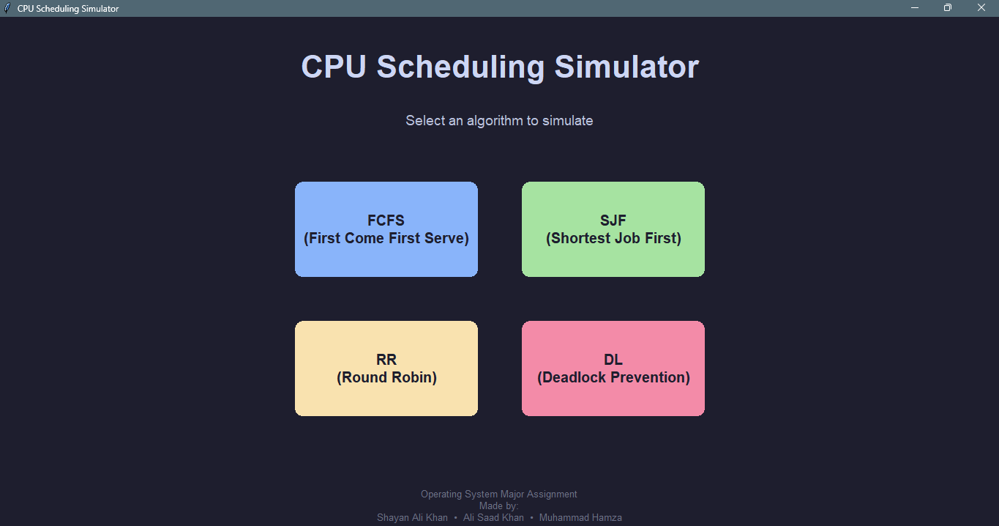

# CPU Scheduling Simulator

A comprehensive desktop application for simulating and visualizing CPU scheduling algorithms with an intuitive graphical user interface.


## 📋 Table of Contents

- [Features](#-features)
- [Screenshots](#-screenshots)
- [Algorithms Implemented](#-algorithms-implemented)
- [Installation](#-installation)
- [Usage](#-usage)
- [Project Structure](#-project-structure)
- [Building Desktop Application](#-building-desktop-application)
- [Technologies Used](#-technologies-used)
- [Contributing](#-contributing)
- [License](#-license)

## ✨ Features

- **Interactive GUI**: Modern, user-friendly interface with dark theme
- **Multiple Scheduling Algorithms**: 
  - First Come First Serve (FCFS)
  - Shortest Job First (SJF)
  - Round Robin (RR)
- **Visual Gantt Charts**: Colorful, interactive Gantt charts for process visualization
- **Timeline Visualization**: Step-by-step timeline showing process execution
- **Process Metrics**: Detailed metrics including:
  - Waiting Time
  - Turnaround Time
  - Response Time
  - Average metrics
- **Deadlock Prevention**: Banker's Algorithm implementation with visual output
- **Desktop Application**: Standalone executable for easy distribution

## 🖼️ Screenshots

### Main Menu
The application starts with a clean main menu offering four options:
- **FCFS** (First Come First Serve)
- **SJF** (Shortest Job First)
- **RR** (Round Robin)
- **DL** (Deadlock Prevention)



### Algorithm Simulation
Each algorithm provides:
- Input form for process details
- Dynamic table generation
- Real-time calculation
- Visual Gantt chart with color-coded processes
- Detailed metrics table
- Timeline visualization


## 🔢 Algorithms Implemented

### 1. First Come First Serve (FCFS)
- **Type**: Non-preemptive
- **Description**: Processes are executed in the order they arrive
- **Features**: Simple and fair, but may cause long waiting times

### 2. Shortest Job First (SJF)
- **Type**: Non-preemptive
- **Description**: Process with shortest burst time executes first
- **Features**: Optimal for minimizing average waiting time

### 3. Round Robin (RR)
- **Type**: Preemptive
- **Description**: Each process gets a time quantum to execute
- **Features**: Fair scheduling with configurable time quantum

### 4. Deadlock Prevention (Banker's Algorithm)
- **Type**: Deadlock avoidance
- **Description**: Prevents deadlock by checking system safety before resource allocation
- **Features**: 
  - Safe sequence detection
  - Resource allocation visualization
  - Step-by-step execution display

## 📦 Installation

### Prerequisites
- Python 3.7 or higher
- pip (Python package manager)

### Clone the Repository
```bash
git clone https://github.com/yourusername/CPU_scheduling_simulator.git
cd CPU_scheduling_simulator
```

### Install Dependencies
```bash
pip install -r requirements.txt
```

**Note**: This project uses only Python standard library (tkinter) - no external dependencies required for basic functionality.

## 🚀 Usage

### Running the GUI Application
```bash
python run_gui.py
```

### Running the CLI Version
```bash
python main.py
```

### GUI Workflow
1. **Select Algorithm**: Choose from FCFS, SJF, RR, or Deadlock Prevention
2. **Enter Process Count**: Specify the number of processes
3. **Input Process Details**: 
   - Process ID (PID)
   - Arrival Time
   - Burst Time
   - Priority (optional for FCFS/SJF)
   - Time Quantum (for Round Robin)
4. **Run Algorithm**: Click "RUN {ALGORITHM}" button
5. **View Results**: 
   - Gantt Chart visualization
   - Timeline display
   - Process metrics table
   - Average waiting and turnaround times

## 📁 Project Structure

```
CPU_scheduling_simulator/
│
├── algorithms/              # Scheduling algorithm implementations
│   ├── FCFS.py             # First Come First Serve
│   ├── SJF.py              # Shortest Job First
│   ├── RR.py               # Round Robin
│   └── __init__.py
│
├── utils/                   # Utility functions
│   ├── Helpers.py           # Helper functions (averages, sorting)
│   ├── Gantt_Charts.py      # Gantt chart utilities
│   └── __init__.py
│
├── advance_features/        # Advanced features
│   ├── Deadlock_prevention.py  # Banker's Algorithm
│   ├── bankers_data.py      # Banker's algorithm data
│   └── __init__.py
│
├── gui/                     # Graphical user interface
│   ├── main_window.py       # Main menu window
│   ├── scheduler_ui.py      # Algorithm UI components
│   └── __init__.py
│
├── main.py                  # CLI version entry point
├── run_gui.py              # GUI version entry point
├── build_app.spec          # PyInstaller configuration
├── icon.ico                 # Application icon
└── README.md               # This file
```

## 🏗️ Building Desktop Application

### Prerequisites
```bash
pip install pyinstaller
```

### Step 1: Remove Conflicting Package (if needed)
```bash
python -m pip uninstall typing
```


### Step 3: Build Executable
```bash
pyinstaller build_app.spec
```

**OR** using direct command:
```bash
pyinstaller --name="CPU_Scheduling_Simulator" --onefile --windowed --icon=icon.ico --add-data "algorithms;algorithms" --add-data "utils;utils" --add-data "advance_features;advance_features" --add-data "gui;gui" run_gui.py
```

### Step 4: Find Your Application
The executable will be located in:
```
dist/CPU_Scheduling_Simulator.exe
```

This standalone executable can run on any Windows machine without Python installation.

## 🛠️ Technologies Used

- **Python 3.7+**: Core programming language
- **Tkinter**: GUI framework (built-in Python library)
- **PyInstaller**: Desktop application builder

## 📊 Algorithm Details

### Input Format
Each process requires:
- **PID**: Process identifier (e.g., "P1", "P2")
- **Arrival Time**: Time when process arrives (≥ 0)
- **Burst Time**: CPU time required (> 0)
- **Priority**: Optional priority value (for FCFS/SJF)
- **Time Quantum**: Time slice for Round Robin (for RR only)

### Output Format
For each algorithm, the application displays:
- **Gantt Chart**: Visual representation of process execution
- **Execution Order**: Sequence of process execution
- **Timeline**: Detailed timeline with time labels
- **Process Metrics**: 
  - Waiting Time
  - Turnaround Time
  - Response Time
- **Average Metrics**: 
  - Average Waiting Time
  - Average Turnaround Time

## 🎯 Use Cases

- **Educational Purpose**: Learn CPU scheduling algorithms
- **Algorithm Comparison**: Compare different scheduling strategies
- **Visualization**: Understand process execution flow
- **Deadlock Study**: Learn deadlock prevention techniques

## 🤝 Contributing

### 👥 Contributors

- **Ali Saad Khan**
- **Shayan Ali Khan**

Contributions are welcome! Please feel free to submit a Pull Request. For major changes, please open an issue first to discuss what you would like to change.

### Contribution Guidelines
1. Fork the repository
2. Create your feature branch (`git checkout -b feature/AmazingFeature`)
3. Commit your changes (`git commit -m 'Add some AmazingFeature'`)
4. Push to the branch (`git push origin feature/AmazingFeature`)
5. Open a Pull Request

## 📝 License

This project is licensed under the MIT License - see the [LICENSE](LICENSE) file for details.

## 👤 Author

**Your Name**
- GitHub: [@khalifa-codes](https://github.com/khalifa-codes)
- Email: hamzaxali70@gmail.com

## 🙏 Acknowledgments

- Inspired by operating systems course curriculum
- Built for educational and demonstration purposes
- Thanks to the open-source community for tools and libraries

## 📞 Support

If you encounter any issues or have questions:
- Open an issue on GitHub
- Check existing issues for solutions
- Review the documentation

---

**⭐ If you find this project helpful, please consider giving it a star!**

